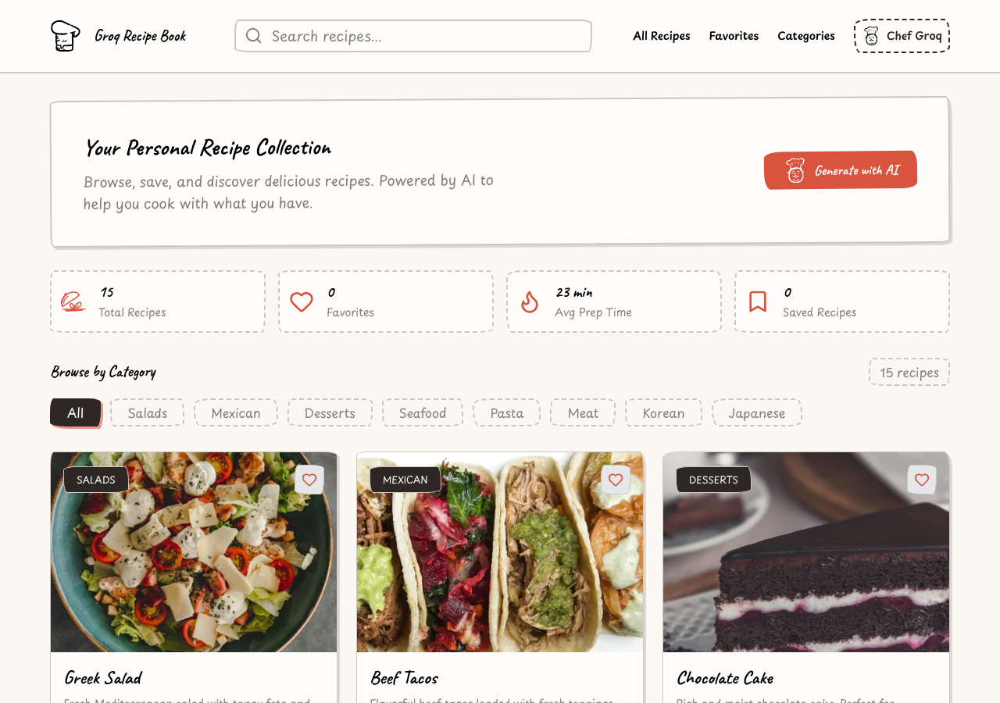

# Phase 2 compatibility breadth closure — 2026-09-15

**P05 PARTIAL · P06 PARTIAL · P07 PASS · P08 PARTIAL. Phase 2 internal software closure: NOT YET.**

Continued the authoritative final-internal checkpoint, without reconstructing P01–P64.
Initial origin fetch, clean branch, expected feature `0f33e11ea60ee4b69ed6a0de5144f73400fe5808`,
implementation ancestor `2d0087ac8a009af36dd43023e988f7dfdcbd6e69`, and unchanged
main `dd2d9cf8ffa6d82e4fdbb3e0ab37fa43ea9f945b` were verified before implementation.
The first frozen candidate is `aedbc02414f66d6b2ce83c288dc6c2e246b4ea79`; the final
product implementation is `bc19fac8d91d7360c409285e8613509c3c4e7404`.
The final documentation commit also hardens corpus QA temporary-directory cleanup;
it changes no product runtime. Publication SHA/remote verification accompanies the final task output.

The current matrix is **46 PASS / 5 PARTIAL / 1 deferred later-phase FAIL / 12 EXTERNAL-EVIDENCE**.
Only P05–P08 rows changed. P39/P61 were not deliberately worked on. P64 and all Phase3/4/5
product scope remain intact. This is neither a public deployment nor authorization to begin Phase3.

[Evidence index](phase2-compatibility-breadth-evidence/index.json),
[current ledger](phase2-final-internal-evidence/final-ledger.json),
[prior ledger](phase2-compatibility-breadth-evidence/prior-ledger.json),
[exact application stages](phase2-compatibility-breadth-evidence/application-stage-results.json),
and [regression identities](phase2-compatibility-breadth-evidence/regressions.json) are the working index.
Previous reports and failures remain visible.

## Newly closed requirements

- **P05 subset:** Yarn classic v1 registry/SRI locks and Bun text JSONC v1 locks are bounded data parsers. Every admitted graph must match operator-owned exact versions/integrity/dependency edges and complete required peers; optional peers/platform branches remain explicit. Neither manager nor an uploaded bundled binary is executed. Two pinned general CSS profiles expand common dependency semantics.
- **P06 subset:** finite custom HTML mount IDs, one local module entry, body/head metadata, local styles and static resources; finite nested/path.resolve/URL aliases, same-directory TS relationships, publicDir/base and explicit root `.`. Trusted no-argument React/Tailwind4/tsconfig-paths/Uno plugin declarations have known implementations. Uploaded executable config/plugins never run.
- **P07 public values:** a controlled server-owned PublicRuntimeValueProvider carries explicitly public VITE values by workspace/project/session/revision, with fresh authority around asynchronous reads. Secret-like names/values are rejected. No process-private environment or example-env values are automatically injected; source/export is unchanged.
- **P07 intake:** narrow .node-version/.nvmrc/.whitesource/_redirects/.hbs and public example-env metadata; recognized bounded binary Bun v2 bytes are preserved opaquely, never resolved or executed. Bulletproof and Todo now pass unchanged archive intake. No blanket binary/dotfile permission or member-limit exception.
- **P07 static resources:** a separate trusted HTTPS DNS-pinned image/font/CSS fetch/cache materializes authorized immutable source snapshots. The exact Recipe application obtains all required resources through this boundary, including Fast Refresh bootstrap/update manifests. The native runner still cannot access the Internet directly.
- **P08 subset:** pinned Tailwind3.4.17/PostCSS8.5.8/autoprefixer10.4.21 and Uno66.0.0 adapters handle finite configuration without importing it. Tailwind content/theme/screens/extend, typography/animate/default sans; Uno static rules/shortcuts/theme/presetUno/presetAttributify. Fixed CSS workers enforce dedicated resolution, empty environment, heap/deadline/concurrency bounds.

The [profile documentation](../../runtime-profiles/README.md) records exact formats and
operator preparation. Labels distinguish complete admitted support, partial implemented
subsets, metadata preserved but not applied, and unsupported/Code-only behavior. No generic
plugin/package-manager or arbitrary executable-config support is claimed.

## Exact remaining P05–P08 internal blockers

| ID | Remaining requirement and concrete evidence | Why it remains |
|---|---|---|
| P05.1 | Yarn Berry checksum/virtual graph semantics; classic npm-alias/protocol/workspace lock descriptors. Redux uses Yarn4; Bulletproof's classic lock contains an npm alias. | The current adapter proves only registry semver/SRI graphs. Alternate identity/checksum/virtual-peer semantics need a separately verified resolver, not a parse-error profile fallback. |
| P05.2 | Bun binary dependency graph resolution and unprovided root/version graphs. Todo retains its262,443-byte binary lock; the exact missing package/version lists for all three blocked apps are retained in application-stage-results.json. | Opaque byte preservation does not establish package identities/integrity. Broader exact trusted profiles/format semantics remain internal work. |
| P05.3 | Redux `.yarn/releases/yarn-4.2.2.cjs` is2,742,928bytes, above the unchanged2MiB member bound. | No general, security-reviewed inert-tooling role/transport/export exception was implemented. Relabeling an executable file or dropping it does not solve this constraint. |
| P06.1 | Non-root Vite root and unimplemented build/plugin effects; Bulletproof specifically declares Rollup external `fs/promises` and output `experimentalMinChunkSize:3500`. | The preview cannot pretend those build effects are applied. A finite equivalent or separately justified isolated configuration design is still required. |
| P06.2 | Todo's TS `@` path lacks a matching Vite alias or recognized tsconfig-paths plugin. | Guessing a browser resolution relationship would silently change configuration. This retained ambiguous case stays unsupported. |
| P08.1 | Todo's `@julr/unocss-preset-forms`, `transformerDirectives`, `transformerVariantGroup`, additional preset options including `presetUno({dark:'media'})`, and its exact older graph. | The finite Uno adapter does not reproduce these effects; it must not execute the uploaded configuration or silently omit required transformations. |
| P08.2 | Additional non-admitted CSS compiler versions/plugin semantics outside the two exact new profiles. | Current support is finite and pinned. Dynamic functions/regex/custom plugins are explicitly refused, not an implicit claim of generic support. |

**P07 has no remaining blocker for its retained bounded public-env/file/static-resource software requirement.**
HTTP/IPv6/custom-port/authenticated/dynamic/API/active-script fetches and arbitrary files
remain outside the admitted boundary. An external resource exceeding bounds may legitimately
fail safely; successful fetching does not promise availability or production capacity.
These remaining P05/P06/P08 rows are **internal engineering**, not external credentials or
DoD waivers. This run closes several concrete subrequirements without relabeling those rows PASS.

## Original application results

The exact original commits, subdirectories, archive hashes and every canonical file hash
were preserved. General adapter/profile rules contain no repository-name compatibility branch.
No upstream source/config/dependency was edited, filtered or silently dropped.

| Original application | Intake → dependency/profile → configuration → compilation → runtime → assets → render |
|---|---|
| Redux Essentials | **FAIL → FAIL → diagnostic PASS → NOT REACHED → NOT REACHED → NOT REACHED → NOT REACHED**. Oversized bundled Yarn still blocks intake; Berry/profile gaps remain.24 exact file hashes checked only in separate static diagnosis after failed intake. |
| Bulletproof React | **PASS → FAIL → FAIL → NOT REACHED → NOT REACHED → NOT REACHED → NOT REACHED**.168 unchanged files now admitted. Alias protocol/root graph, retained Rollup effects and unset explicit public runtime values remain diagnosed. |
| todo-list-react | **PASS → FAIL → FAIL → NOT REACHED → NOT REACHED → NOT REACHED → NOT REACHED**.38 unchanged files include opaque binary Bun. Binary graph, missing profile, alias relationship, Uno effects and unset explicit public values remain diagnosed. |
| Recipe Book | **PASS → PASS → PASS → PASS → PASS → PASS → PASS** for unchanged import through render.67 canonical files and read-only packaged export match exactly. This is compatibility-stage evidence, not a new claim that every complete editing workflow was repeated. |

Recipe uses frozen commit `bdffa12b1e2f5a0ae46257ed41762044619b7773`, archive
`046a9e510c63081eec62a443133ee172c89a89e040e795d21f8f5336b1c0827f`.
The packaged TLS editor, TEST OIDC, PostgreSQL authority/artifacts, mTLS gateway and native
Linux runner were exercised. Its immutable audit records **38 resources:15 WebP images,
1 PNG,21 WOFF2 fonts and1 stylesheet;2,191,670 response bytes**. Every fetch uses the same
general boundary; no Cloudinary/Google project exception exists.

The exact PostgreSQL Fast Refresh artifact independently renders under the unchanged native
sandbox. Visible images decode, Caveat/Playpen Sans load, no page errors or external requests
occur, and direct TCP1.1.1.1:443 returns **ENETUNREACH**. Chromium namespace/Seccomp checks pass.
The only missing resource is upstream optional `/public/logo.svg` (`other` resource type).
The upstream React19/Tippy development `element.ref` console warning is retained. It was not
mistaken for a browser page exception. [Native proof](phase2-compatibility-breadth-evidence/recipe-native.json),
[packaged proof](phase2-compatibility-breadth-evidence/recipe-hosted.json),
[artifact digest manifest](phase2-compatibility-breadth-evidence/recipe-artifact-manifest.json).

## Trust boundaries and security review

[Threat model](phase2-compatibility-breadth-evidence/threat-model.md) preceded implementation.
The Source Is the Product remains enforced: unchanged files/configs are canonical; only
compiler artifacts receive instrumentation/cached resource references. No uploaded manager,
lifecycle script, Vite/PostCSS/Tailwind/Uno executable config or arbitrary plugin runs in
the trusted editor. No host dependency fallback, runner egress opening, timeout inflation,
archive security reduction, public deployment, main merge or force push occurred.

Static assets are not a URL RPC. Fresh tenant/project/session/source authority gates the
compiler snapshot before/after asynchronous work. HTTPS URLs have no credentials/custom
headers/cookies; DNS is checked and pinned, redirects revalidated, private/loopback/link-local/
metadata/reserved ranges refused. Response compression is refused; MIME plus raster/font
signatures exclude remote SVG/HTML/JavaScript. Bounds remain2MiB/response,8MiB aggregate,
48 resources,3 redirects, depth4,10seconds, four concurrent transfers/materializations.
The cache is content-addressed and snapshot-scoped; no cross-tenant URL cache is implied.

Codex Security scan **28b26b91-59c0-412e-ba34-1ba51d8d55bb** sealed all32 changed paths in
`0f33e11..aedbc024`. One low-severity CWE-400/CWE-407 finding identified repeated full-bundle
copying for duplicate resource literals. The final implementation builds output once from
ordered disjoint slices. Ordinary repeated-literal tests preserve source and surrounding code.
HTML URL ASCII controls and finite-CSS host preload were also hardened. A real packaged check
then exposed Fast Refresh nested module URLs; its generated bootstrap/update manifest now
share the same bounded rewritten data. Affected final security paths were independently reread
at recorded hashes, including this integration change. **Confirmed unresolved vulnerabilities:0.**

[Canonical sealed report](phase2-compatibility-breadth-evidence/security/report.md) preserves the
original immutable-candidate finding; [final remediation receipt](phase2-compatibility-breadth-evidence/security/final-remediation.json)
and final-path reviews identify the corrected implementation. Historical attack-path wording
about a pending reread is superseded by the final receipt; the sealed report was not edited.
A cybersecurity safeguard blocked the attempted stress reproduction. It was not retried or
bypassed; no crash/timing/quantitative DoS measurement is claimed. Static source/control/sink
analysis and normal regressions support the finding and fix. This is not a professional pentest.
The Daybreak eligibility check reported not granted. Tool-measured usage:14,232,343 total,
14,165,537 input,13,724,672 cached-input tokens (complete rollout measurement across5 threads).

Post-review changes are documentation/evidence and a QA-only move of temporary corpus source
outside the repository with finally cleanup. The parent reread that data-only path/cleanup change
and syntax-checked it. It grants no package execution or altered admission path.

## Verification, reuse and historical failures

**549 distinct passing tests, including all prior429 identities and120 added identities.**
All30 original test files are byte-exact; all old profile manifests/locks are byte-exact.
The future-iat OIDC case embeds wall-clock time in its generated title; both exact old/new
labels and their verified unchanged source identity are explicitly recorded, not silently renamed.

The final owned default suite passes504, with45 skips accounted for separately. Native group
passes69 (33 additional identities); packaged hosted group passes12. The union has no outstanding
skip or failure. TypeScript and production build pass. All five retained real-browser groups
pass once after stabilization. New adversarial cases cover SSRF addresses, redirects/rebinding,
credentials, limits, invalid/active MIME, timeouts, authorization loss, HTML controls, lock/peer
verification, CSS config refusal and dedicated transitive compiler confinement.

Prior native OS, unchanged export-build/render and full Kanban/Habit workflow evidence is
reused where implementation/inputs/policy did not change. No new P39/P61/endurance/capacity or
third complete editing-workflow claim is inferred from these results.

All historical failures remain in [failure notes](phase2-compatibility-breadth-evidence/harness-and-failure-notes.json)
and raw receipts. In particular:

- An early unrestricted Vitest collection attempted14 upstream Bulletproof suites in a temporary repository directory and failed on missing helpers. It is not counted as a successful WebCanBe run. Final commands target the owned suite, and corpus QA now materializes outside the repository with guaranteed cleanup.
- The first hosted group had11 passes and a missing Playwright-module harness error; all12 then passed using the existing bundled module. No existing test changed.
- Initial Recipe HTML/CSS/data-resource/deadline failures remain; subsequent fixes are general. Fonts-only packaged caching exposed the Fast Refresh integration gap and was not called a full asset pass.
- One packaged startup returned a generic422 while the full default suite was running simultaneously. The precise cause was not exposed; later isolated startup passed around7seconds. The failure remains unexplained and is not erased by success or used for a load/capacity claim. This does not extend P61 closure.
- New Recipe QA initially classified expected upstream console messages as page errors, used an existing export extraction directory, and queried a nonexistent cleanup column. Those failures are retained. The exact native artifact and a separate read-only export check resolve those harness assertions without repeating expensive asset workflows solely for report freshness.

Automatic approval review rejected a proposed fallback after alternate-lock parse failure
because it could fail open on dependency admission. The proposal was omitted; unsupported
lock semantics still refuse runtime.

## Unchanged other blockers and publication

**P39:** Native OS input-method completion, full screen-reader/accessibility behavior and
sustained renewed-session/endurance proof remain unverified.

**P61:** Normal packaged hosted Zustand still fails within the unchanged4000ms raster bound;
the first two-application warm-update run returned an unexplained422 on the second application;
sustained representative load/endurance remains unproved.

External production-evidence rows remain exactly **P29/P41/P43/P45/P46/P48/P49/P50/P51/P52/P55/P56**.
Their original finite obligations and status are unchanged in the authoritative ledger and
prior report. No local fake PASS replaces production IdP/HTTPS/DNS/cookie, database TLS/PITR/
restore, deployed isolation/capacity/outage/secrets/security or professional testing evidence.
P64 remains deferred later-phase scope.

All31 TEST gateway leases and native preview/profile units were stopped before cleanup.
Owned gateway/tunnels/schema/password/PKI/config/helpers were removed; the VM is stopped.
[Cleanup receipt](phase2-compatibility-breadth-evidence/cleanup.json).
Archived evidence .cjs files record QA run from `.webcanbe/compatibility-breadth`; they are not standalone scripts at their archival location.

Only a normal push of `phase-2-compatible-editor` is authorized. The final task publication
receipt verifies a clean worktree, matching live feature SHA, and unchanged origin/main and live main (this recovery checkout has no local main branch).

**Phase2 internal software closure: NOT YET. Overall Phase2: NOT YET. Public hosted import ready:NO.
Phase3 may begin under original DoD:NO.**
